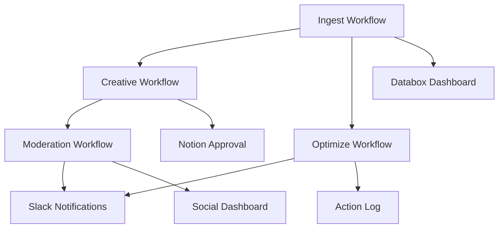

# System Architecture

## Overview

The Cross-Platform Ad Optimization Agent is a comprehensive low-code system built on n8n that orchestrates data ingestion, AI-powered creative generation, campaign optimization, and social media moderation. The architecture follows a microservices pattern with clear separation of concerns and robust error handling.

## 🏗️ High-Level Architecture

```
┌─────────────────────────────────────────────────────────────────┐
│                        n8n Workflow Engine                      │
├─────────────────────────────────────────────────────────────────┤
│  ┌─────────────┐  ┌─────────────┐  ┌─────────────┐  ┌─────────────┐ │
│  │   Ingest    │  │  Creative   │  │  Optimize   │  │ Moderation  │ │
│  │ Workflow    │  │ Workflow    │  │ Workflow    │  │ Workflow    │ │
│  └─────────────┘  └─────────────┘  └─────────────┘  └─────────────┘ │
└─────────────────────────────────────────────────────────────────┘
                                │
                                ▼
┌─────────────────────────────────────────────────────────────────┐
│                    Data & Service Layer                         │
├─────────────────────────────────────────────────────────────────┤
│  ┌─────────────┐  ┌─────────────┐  ┌─────────────┐  ┌─────────────┐ │
│  │  Supabase   │  │   Notion    │  │   Slack     │  │   Databox   │ │
│  │ (Database)  │  │ (Approval)  │  │ (Alerts)    │  │ (Analytics) │ │
│  └─────────────┘  └─────────────┘  └─────────────┘  └─────────────┘ │
└─────────────────────────────────────────────────────────────────┘
                                │
                                ▼
┌─────────────────────────────────────────────────────────────────┐
│                    External APIs & Services                     │
├─────────────────────────────────────────────────────────────────┤
│  ┌─────────────┐  ┌─────────────┐  ┌─────────────┐  ┌─────────────┐ │
│  │  Klaviyo    │  │   OpenAI    │  │ Meta Graph  │  │ Google Ads  │ │
│  │ (Real API)  │  │ (AI/LLM)    │  │ (Social)    │  │ (Ads)       │ │
│  └─────────────┘  └─────────────┘  └─────────────┘  └─────────────┘ │
└─────────────────────────────────────────────────────────────────┘
```

## 🔄 Data Flow Architecture

### 1. Data Ingestion Flow

```
External APIs → n8n Ingest → Data Normalization → Supabase + Notion → Databox
     │              │              │                    │              │
     │              │              │                    │              │
  Klaviyo      Cron Trigger    Schema Mapping      Storage Layer   Visualization
  Mock API     Data Fetch      Deduplication       Audit Trail     Performance
```

### 2. Creative Generation Flow

```
Campaign Brief → Performance Data → AI Analysis → Novelty Check → Staging
      │               │                │              │            │
      │               │                │              │            │
   Notion         Supabase         OpenAI         Similarity    Notion Queue
   Database       Analytics        GPT-4         Algorithm     Ad Platform
```

### 3. Optimization Flow

```
Performance Data → Rule Engine → Service Gating → Action Execution → Notifications
       │              │              │                │                │
       │              │              │                │                │
   Supabase       Rule Config    Time/Volume      Platform APIs    Slack Alerts
   Analytics      Notion DB      Validation       Action Log       Action Log
```

### 4. Moderation Flow

```
Social Media → AI Classification → Action Decision → Approval Queue → Execution
      │              │                    │              │              │
      │              │                    │              │              │
   Meta API      OpenAI GPT-4        Auto Actions    Notion DB     Platform APIs
   Webhooks      Sentiment/Intent    Escalation      Approval      Confirmation
```

## 🗄️ Database Architecture

### Supabase PostgreSQL Schema

#### Core Tables

```sql
-- Campaign performance data (normalized across platforms)
campaign_performance
├── id (UUID, PK)
├── date (DATE)
├── platform (VARCHAR)
├── campaign_id (VARCHAR)
├── campaign_name (VARCHAR)
├── spend (DECIMAL)
├── impressions (BIGINT)
├── clicks (BIGINT)
├── conversions (BIGINT)
├── cpl (DECIMAL)
├── roas (DECIMAL)
└── created_at (TIMESTAMP)

-- Creative variants and AI-generated content
creative_variants
├── id (UUID, PK)
├── campaign_id (VARCHAR)
├── platform (VARCHAR)
├── headline (TEXT)
├── primary_text (TEXT)
├── copy_angle (VARCHAR)
├── rationale (TEXT)
├── similarity_score (DECIMAL)
├── status (VARCHAR)
└── created_at (TIMESTAMP)

-- Optimization rules and actions
optimization_rules
├── id (UUID, PK)
├── rule_name (VARCHAR)
├── platform (VARCHAR)
├── rule_type (VARCHAR)
├── conditions (JSONB)
├── actions (JSONB)
├── service_time_gating (JSONB)
└── is_active (BOOLEAN)

optimization_actions
├── id (UUID, PK)
├── campaign_id (VARCHAR)
├── platform (VARCHAR)
├── rule_id (UUID, FK)
├── action_type (VARCHAR)
├── action_details (JSONB)
├── performance_snapshot (JSONB)
├── service_time_met (BOOLEAN)
├── action_taken (BOOLEAN)
└── created_at (TIMESTAMP)

-- Social media moderation
social_media_items
├── id (UUID, PK)
├── platform (VARCHAR)
├── object_id (VARCHAR)
├── object_type (VARCHAR)
├── user_id (VARCHAR)
├── text (TEXT)
├── permalink (TEXT)
├── created_time (TIMESTAMP)
└── raw_data (JSONB)

item_classifications
├── id (UUID, PK)
├── item_id (UUID, FK)
├── intent (VARCHAR)
├── sentiment (VARCHAR)
├── confidence_score (DECIMAL)
├── reply_required (BOOLEAN)
└── created_at (TIMESTAMP)

moderation_actions
├── id (UUID, PK)
├── item_id (UUID, FK)
├── action_type (VARCHAR)
├── action_status (VARCHAR)
├── suggested_reply (TEXT)
├── notion_record_id (VARCHAR)
├── executed_at (TIMESTAMP)
└── created_at (TIMESTAMP)
```

#### Indexes and Performance

```sql
-- Performance indexes
CREATE INDEX idx_campaign_performance_date_platform ON campaign_performance(date, platform);
CREATE INDEX idx_campaign_performance_campaign_id ON campaign_performance(campaign_id);
CREATE INDEX idx_creative_variants_campaign_platform ON creative_variants(campaign_id, platform);
CREATE INDEX idx_optimization_actions_campaign_platform ON optimization_actions(campaign_id, platform);
CREATE INDEX idx_social_media_items_platform_type ON social_media_items(platform, object_type);
CREATE INDEX idx_item_classifications_intent ON item_classifications(intent);

-- Composite indexes for complex queries
CREATE INDEX idx_campaign_performance_platform_date_spend ON campaign_performance(platform, date, spend);
CREATE INDEX idx_optimization_actions_type_status ON optimization_actions(action_type, action_taken);
CREATE INDEX idx_moderation_actions_status_type ON moderation_actions(action_status, action_type);
```

## 🔧 n8n Workflow Architecture

### Workflow Design Patterns

#### 1. Event-Driven Architecture

```javascript
// Trigger patterns
{
  "cron": "0 6 * * *", // Daily at 6 AM
  "webhook": "/webhook/creative-generation",
  "button": "manual-trigger",
  "polling": "every-5-minutes"
}
```

#### 2. Error Handling Pattern

```javascript
// Standard error handling across all workflows
{
  "retry": {
    "maxAttempts": 3,
    "backoffStrategy": "exponential",
    "baseDelay": 1000,
    "maxDelay": 10000
  },
  "errorHandling": {
    "onError": "continue",
    "logErrors": true,
    "notifyOnFailure": true
  }
}
```

#### 3. Data Validation Pattern

```javascript
// Input validation for all external data
const validateInput = (data, schema) => {
  const errors = [];

  schema.required.forEach((field) => {
    if (!data[field]) {
      errors.push(`Missing required field: ${field}`);
    }
  });

  schema.types.forEach(({ field, type }) => {
    if (data[field] && typeof data[field] !== type) {
      errors.push(`Invalid type for ${field}: expected ${type}`);
    }
  });

  return {
    valid: errors.length === 0,
    errors,
  };
};
```

#### 4. Idempotency Pattern

```javascript
// Ensure safe re-runs
const ensureIdempotency = async (operation, key) => {
  const existing = await checkExistingOperation(key);
  if (existing) {
    return existing.result;
  }

  const result = await operation();
  await storeOperationResult(key, result);
  return result;
};
```

### Workflow Dependencies



## 🔌 API Integration Architecture

### Authentication Strategy

```javascript
// Centralized credential management
const credentials = {
  klaviyo: {
    type: "api_key",
    storage: "n8n_credentials",
    rateLimit: "600/minute",
  },
  openai: {
    type: "api_key",
    storage: "n8n_credentials",
    rateLimit: "10000/minute",
  },
  meta: {
    type: "oauth2",
    storage: "n8n_credentials",
    rateLimit: "200/hour",
  },
  supabase: {
    type: "service_key",
    storage: "n8n_credentials",
    rateLimit: "1000/minute",
  },
};
```

### Rate Limiting Strategy

```javascript
// Adaptive rate limiting
const rateLimiter = {
  klaviyo: {
    limit: 600,
    window: 60000, // 1 minute
    strategy: "sliding_window",
  },
  openai: {
    limit: 10000,
    window: 60000,
    strategy: "token_based",
  },
  meta: {
    limit: 200,
    window: 3600000, // 1 hour
    strategy: "fixed_window",
  },
};
```

### Circuit Breaker Pattern

```javascript
// Prevent cascade failures
const circuitBreaker = {
  threshold: 5, // failures
  timeout: 60000, // 1 minute
  fallback: "use_cached_data",
  monitor: "health_check",
};
```

## 🛡️ Security Architecture

### Data Protection

```javascript
// Encryption at rest and in transit
const securityConfig = {
  encryption: {
    atRest: "AES-256",
    inTransit: "TLS 1.3",
    keyManagement: "AWS KMS",
  },
  access: {
    principle: "least_privilege",
    authentication: "oauth2",
    authorization: "rbac",
  },
  audit: {
    logging: "comprehensive",
    retention: "90_days",
    monitoring: "real_time",
  },
};
```

### API Security

```javascript
// API security measures
const apiSecurity = {
  authentication: {
    klaviyo: "api_key",
    openai: "api_key",
    meta: "oauth2_bearer",
    supabase: "service_key",
  },
  validation: {
    input: "schema_validation",
    output: "sanitization",
    rate: "per_endpoint",
  },
  monitoring: {
    anomalies: "ml_detection",
    abuse: "pattern_recognition",
    alerts: "real_time",
  },
};
```

## 📊 Monitoring & Observability

### Logging Strategy

```javascript
// Structured logging across all components
const loggingConfig = {
  format: "json",
  levels: ["error", "warn", "info", "debug"],
  destinations: ["console", "file", "remote"],
  correlation: "trace_id",
  metadata: {
    workflow: "workflow_name",
    node: "node_id",
    execution: "execution_id",
    timestamp: "iso_8601",
  },
};
```

### Metrics Collection

```javascript
// Key performance indicators
const metrics = {
  business: {
    "campaigns.processed": "counter",
    "creatives.generated": "counter",
    "actions.taken": "counter",
    "moderation.items": "counter",
  },
  technical: {
    "api.response_time": "histogram",
    "workflow.duration": "histogram",
    "error.rate": "gauge",
    "queue.depth": "gauge",
  },
  custom: {
    "roas.improvement": "gauge",
    "response.time": "histogram",
    "classification.accuracy": "gauge",
  },
};
```

### Alerting Strategy

```javascript
// Multi-level alerting
const alertingConfig = {
  critical: {
    conditions: ["system_down", "data_loss", "security_breach"],
    channels: ["slack", "email", "pagerduty"],
    escalation: "immediate",
  },
  warning: {
    conditions: ["high_error_rate", "slow_response", "queue_backlog"],
    channels: ["slack", "email"],
    escalation: "30_minutes",
  },
  info: {
    conditions: ["workflow_completed", "threshold_exceeded"],
    channels: ["slack"],
    escalation: "none",
  },
};
```

## 🔄 Data Pipeline Architecture

### ETL Process

```javascript
// Extract, Transform, Load pipeline
const etlPipeline = {
  extract: {
    sources: ["klaviyo", "mock_api", "meta_graph"],
    methods: ["api_polling", "webhooks", "batch_processing"],
    scheduling: "cron_based",
  },
  transform: {
    normalization: "schema_mapping",
    validation: "data_quality_checks",
    enrichment: "ai_processing",
    deduplication: "idempotency_keys",
  },
  load: {
    destinations: ["supabase", "notion", "databox"],
    methods: ["upsert", "append", "replace"],
    consistency: "eventual",
  },
};
```

### Data Quality Framework

```javascript
// Comprehensive data quality checks
const dataQuality = {
  completeness: {
    required_fields: "100%",
    optional_fields: ">80%",
    null_handling: "explicit",
  },
  accuracy: {
    format_validation: "schema_based",
    range_validation: "business_rules",
    cross_validation: "reference_data",
  },
  consistency: {
    cross_platform: "normalized_schema",
    temporal: "time_series_validation",
    referential: "foreign_key_checks",
  },
  timeliness: {
    freshness: "<24_hours",
    latency: "<5_minutes",
    availability: ">99.9%",
  },
};
```

## 🚀 Scalability Architecture

### Horizontal Scaling

```javascript
// Auto-scaling configuration
const scalingConfig = {
  n8n: {
    instances: "auto_scale",
    triggers: "load_balanced",
    resources: "cpu_memory_based",
  },
  database: {
    read_replicas: "auto_provision",
    connection_pooling: "pgbouncer",
    partitioning: "date_based",
  },
  apis: {
    rate_limiting: "distributed",
    caching: "redis_cluster",
    cdn: "cloudflare",
  },
};
```

### Performance Optimization

```javascript
// Performance tuning
const performanceConfig = {
  database: {
    indexes: "query_optimized",
    queries: "prepared_statements",
    connections: "pooled",
  },
  workflows: {
    parallelization: "node_level",
    caching: "result_caching",
    batching: "bulk_operations",
  },
  apis: {
    compression: "gzip",
    pagination: "cursor_based",
    filtering: "server_side",
  },
};
```

## 🔧 Configuration Management

### Environment Configuration

```javascript
// Environment-specific settings
const environments = {
  development: {
    database: "local_postgres",
    apis: "sandbox_endpoints",
    logging: "debug_level",
    monitoring: "basic",
  },
  staging: {
    database: "staging_supabase",
    apis: "test_credentials",
    logging: "info_level",
    monitoring: "enhanced",
  },
  production: {
    database: "production_supabase",
    apis: "live_credentials",
    logging: "warn_level",
    monitoring: "full",
  },
};
```

### Feature Flags

```javascript
// Feature toggle system
const featureFlags = {
  ai_creative_generation: {
    enabled: true,
    rollout: "100%",
    fallback: "manual_creation",
  },
  auto_optimization: {
    enabled: true,
    rollout: "50%",
    fallback: "manual_review",
  },
  social_moderation: {
    enabled: true,
    rollout: "100%",
    fallback: "human_moderation",
  },
};
```

## 📈 Analytics Architecture

### Data Warehouse Design

```sql
-- Analytics-optimized schema
CREATE SCHEMA analytics;

-- Fact tables
CREATE TABLE analytics.campaign_performance_fact (
    date_key INT,
    campaign_key INT,
    platform_key INT,
    spend DECIMAL(10,2),
    impressions BIGINT,
    clicks BIGINT,
    conversions BIGINT,
    cpl DECIMAL(10,2),
    roas DECIMAL(10,4)
);

-- Dimension tables
CREATE TABLE analytics.campaign_dim (
    campaign_key INT PRIMARY KEY,
    campaign_id VARCHAR(100),
    campaign_name VARCHAR(255),
    platform VARCHAR(50),
    account_id VARCHAR(100)
);

CREATE TABLE analytics.date_dim (
    date_key INT PRIMARY KEY,
    date DATE,
    year INT,
    quarter INT,
    month INT,
    week INT,
    day_of_week INT
);
```

### Real-time Analytics

```javascript
// Stream processing for real-time insights
const streamProcessing = {
  source: "kafka_topics",
  processing: "apache_flink",
  sink: "clickhouse",
  latency: "<1_second",
  throughput: "10000_events/second",
};
```

## 🔄 Backup & Recovery

### Backup Strategy

```javascript
// Comprehensive backup system
const backupConfig = {
  database: {
    frequency: "daily",
    retention: "30_days",
    method: "pg_dump",
    storage: "s3_encrypted",
  },
  workflows: {
    frequency: "on_change",
    retention: "unlimited",
    method: "git_versioning",
    storage: "github_repository",
  },
  configurations: {
    frequency: "daily",
    retention: "90_days",
    method: "encrypted_export",
    storage: "secure_vault",
  },
};
```

### Disaster Recovery

```javascript
// Recovery procedures
const recoveryConfig = {
  rto: "4_hours", // Recovery Time Objective
  rpo: "1_hour", // Recovery Point Objective
  procedures: {
    database: "point_in_time_recovery",
    workflows: "git_restore",
    configurations: "vault_restore",
  },
  testing: {
    frequency: "monthly",
    scope: "full_system",
    validation: "automated_tests",
  },
};
```

## 📊 Cost Optimization

### Resource Management

```javascript
// Cost optimization strategies
const costOptimization = {
  compute: {
    n8n: "spot_instances",
    database: "reserved_capacity",
    apis: "usage_based_pricing",
  },
  storage: {
    database: "compression_enabled",
    logs: "lifecycle_policies",
    backups: "cold_storage",
  },
  network: {
    cdn: "edge_caching",
    apis: "request_batching",
    monitoring: "sampling",
  },
};
```

## 🎯 Future Architecture Considerations

### Microservices Migration

```javascript
// Potential microservices breakdown
const microservices = {
  "data-ingestion": {
    responsibility: "API integration and data collection",
    technology: "Node.js + Express",
    database: "PostgreSQL",
  },
  "ai-processing": {
    responsibility: "Creative generation and classification",
    technology: "Python + FastAPI",
    database: "Redis + PostgreSQL",
  },
  "optimization-engine": {
    responsibility: "Rule evaluation and action execution",
    technology: "Go + Gin",
    database: "PostgreSQL",
  },
  "moderation-service": {
    responsibility: "Social media monitoring and moderation",
    technology: "Node.js + Express",
    database: "PostgreSQL + Redis",
  },
};
```

### Event-Driven Architecture

```javascript
// Event-driven communication
const eventArchitecture = {
  events: {
    "campaign.performance.updated": "optimization_trigger",
    "creative.variant.generated": "approval_workflow",
    "optimization.action.taken": "notification_system",
    "moderation.item.classified": "action_decision",
  },
  messaging: {
    broker: "Apache Kafka",
    patterns: ["pub/sub", "event_sourcing", "cqrs"],
    guarantees: "at_least_once",
  },
};
```

This architecture provides a robust, scalable, and maintainable foundation for the Cross-Platform Ad Optimization Agent, ensuring high performance, reliability, and security while maintaining flexibility for future enhancements.
